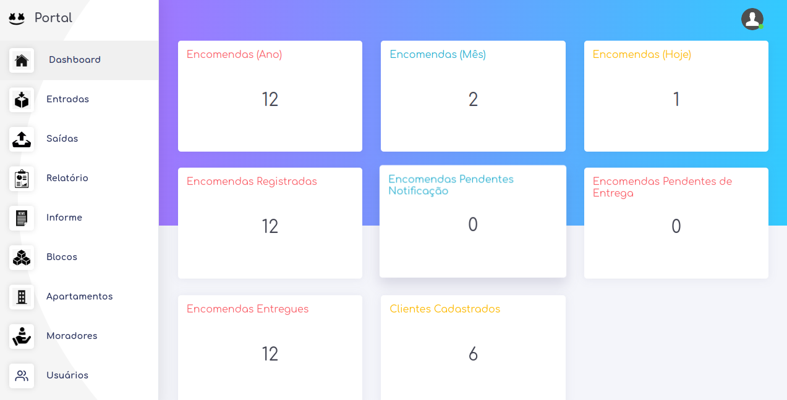
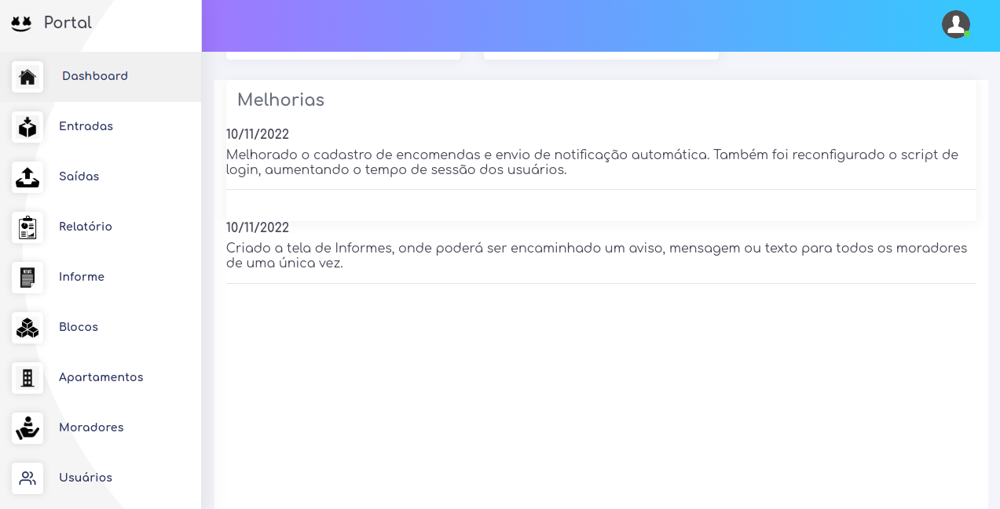

# Dashboard 

Agora vamos realizar uma breve apresentação sobre o campo **Dashborad**

## Quais informações da Dashboard eu consigo obter?

- Encomendas (Ano)
- Encomendas (Mês)
- Encomendas (Dia)
- Total de Encomendas Registradas
- Encomendas Pendentes Notificação
- Encomendas Pendentes de Entrega
- Total Encomendas Entregues
- Clientes Cadastrados

## Melhorias .
Em `Melhorias` , são adicionados todas atualizações e melhorias que no aplicação.
