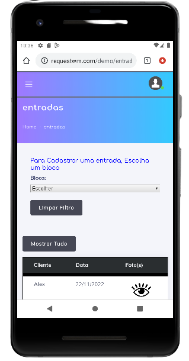

# Entradas

Agora vamos apresentar um dos campos mais utilizados pelos colaboradores, vamos apresentar o campo **Entrada** de mercadorias;
Esse procedimento deve ser realizado em seu smartphone.

## Passo a Passo
Chegou a hora de realizar o registro da mercadoria.
Observe se o filtro encontra-se vazio, caso não esteja, selecione o botão **Limpar Filtro** e aguarde o carregando da página.

- Selecione o **Bloco** correspondente do Morador e aguarde o carregamento da opção **Apto**.
- Após aparecer a opção para selecionar o apartamento, defina o apartamento.
- Na seguinte opção, será apresentado todos os moradores da unidade, selecione o Morador correto.
- Realize a captura da imagem da encomenda.**Observação:** Esse campo é importante observar que a imagem deve ser nitida, em boa qualidade, com foco nas informações da encomenda, capturando o máximo de informações.
- Agora basta clicar com o **Cadastrar** e aguarda o carregamento do envio da mercadoria para o morador.

## Selecionei o bloco ou apto errado
Se você selecionou o bloco ou apartamento errado, é simples, basta selecionar o botão **Limpar Filtro** e realizar a busca novamente.