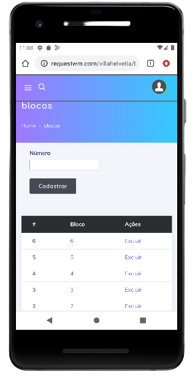
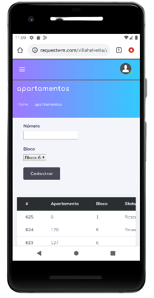

# Blocos e Apartamentos

Cadastros de blocos e apartamentos, é um procedimento simples, onde qualquer usuário pode executar.Só precisamos entender a lógica da criação desses valores.

Antes de executar qualquer cadastro, é importante conferir se já não existe o bloco e apartamento que deseja inserir.

## Bloco 
Para realizar o cadastro de **blocos** é bem simples, basta inserir o número e selecionar o botão **Cadastrar**.

## Apartamentos
Para realizar o cadastro de **apartamentos**, selecione o bloco correspondente, na sequência selecione o número do apartamento, na sequência selecione **Cadastrar**.
