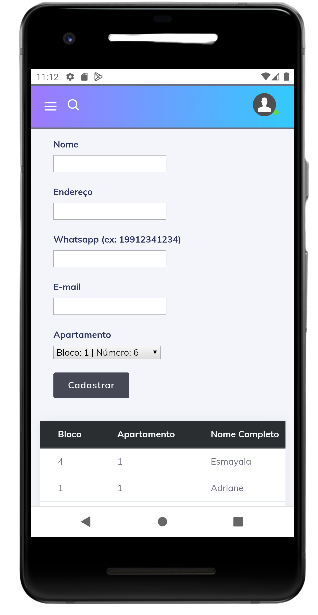

# Moradores

Cadastros de Moradores também é um procedimento simples e usuário pode executar. Antes de executar qualquer cadastro, é importante conferir se já não existe esse Morador inserido.

## Cadastro de Moradores

- Insira o Nome e Sobrenome do Morador.
- No campo endereço, informe o nome do condomínio ou o endereço do Morador.
- Insira o número de celular(whatsapp) do morador **sem caracteres especiais  ex:  - e ()**
- No campo e-mail insira um e-mail válido.
- Selecione o bloco e apartamento desejado.
- Após conferir as informações, selecione a opção **Cadastrar**
