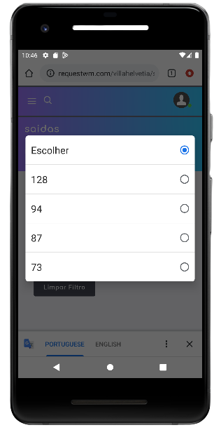

# Saída

Agora vamos apresentar outro campos utilizados pelos colaboradores, vamos apresentar o campo **Saída** de mercadorias.
Esse procedimento deve ser realizado em seu smartphone.

## Passo a Passo
Chegou a hora de realizar o registro da saída da mercadoria.

Denominamos todas encomendas **pendentes** para serem retiradas pelos moradores no topos da tabela, portanto, você pode arrastar e procurar a encomenda. Mais a nível de tempo de resposta para operação, orientamos a utilizar o filtro. Verifique se o mesmo encontra-se vazio, caso **não** esteja, selecione o botão **Limpar Filtro** e aguarde o carregando da página para iniciar a pesquisa.

- Inicie o filtro selecionando o **Bloco** correspondente do morador.

- Na sequência, será retornado todos **apartamentos** que possui encomendas pendentes de entraga.

- Após selecionar o Apartamento correspondente do Morador, a encomenda será exibida,selecione o botão **Enviar**;

- O campo para assinatura irá aparecer, entregue ao morador e solicite a assinatura digital, na sequência selecione o botão **Validar**.

:::tip
## Boas práticas de uso

Agora vamos entender a fundo as informações desta tela.
- Observe que existe um icone com uma caixa, neste campo, ele vai trazer o número de encomendas pendentes para envio.
- Simbolo do "olho" é possível visualizar a encomenda, portanto, essa opção está disponível para auxilia-los quando necessário.
- É possível visualizar o bloco e apartamento do Morador.

<!-- **Obs: Como utilizar o Filtro?**
- Selecione o **Bloco** correspondente do Morador e aguarde o carregamento da opção **Apto**.
- Após aparecer a opção para selecionar o apartamento, defina o apartamento.
- Na seguinte opção, será apresentado todos os moradores da unidade, selecione o Morador correto.
- Realize a captura da imagem da encomenda.**Observação:** Esse campo é importante observar que a imagem deve ser nitida, em boa qualidade, com foco nas informações da encomenda, capturando o máximo de informações.
- Agora basta clicar com o **Cadastrar** e aguarda o carregamento do envio da mercadoria para o morador. -->
:::
